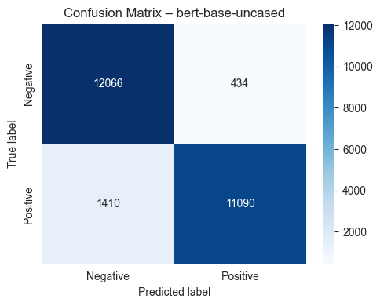
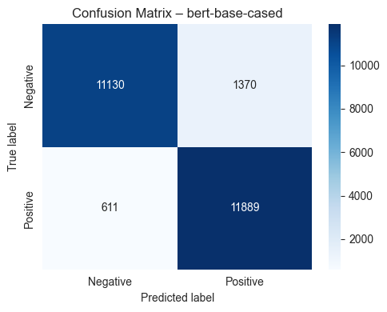

# AML4NLPMiniProjectGroupX
Members: Alexander Rode (arod), Rasmus Herskind (rher)

Consists of two notebooks:
- experiments/baseline.ipynb: Baseline experiments for Bag-of-Words and Term Frequency-Inverse Document Frequency
- experiments/bert-base.ipynb: Experiments and visualisation of using Google's `bert-base-uncased` and `bert-base-cased`

Both notebooks are also in PDF with the final results used for our report. Not however the training results after each epoch is only visible in the .ipynb notebook for bert-base

## How to run code
We use python version 3.11.14, and torch with CUDA

Recommend to use conda. Then create an environment like:
```
conda env create -f environment.yml
```
If using pip, install dependencies:
```
pip install -r requirements.txt
```
Then run the cells in the .ipynb files under the experiments folder or run them with `python 'python_file_here.py'`


# Central problem, domain, data characteristics
We are doing sentiment analysis on the [Standford IMDB Movie Review Dataset](https://huggingface.co/datasets/stanfordnlp/imdb).  
Our goal is to do Binary Classification of each review. That is, we want to predict whether a specific review is positive or negative

## Dataset description

The dataset consists of 25000 training samples and 25000 test samples. Some concrete examples are:

| text                                                                                                                                                                                                                                                                            | label |
|---------------------------------------------------------------------------------------------------------------------------------------------------------------------------------------------------------------------------------------------------------------------------------|-------|
| Ned aKelly is such an important story to Australians but this movie is awful. It's an Australian story yet it seems like it was set in America. Also Ned was an Australian yet he has an Irish accent...it is the worst film I have seen in a long time                         | 0     |
| This is just a short comment but I stumbled onto this movie by chance and I loved it. The acting is great, the story is simple and touching, and the lines, especially from the 4-yr-old Desi, are so cute and sad. Seek it out.                                                | 1     |
| What an inspiring movie, I laughed, cried and felt love. For a true story,it does give you hope and that miracles do happen. It has a great cast. Ellen Burstyn, Samantha Mathis, Jodelle Ferland(she's 4 or 5yrs. old) what a actress. Its on Showtime. A Must See Movie!! :)= | 1     |

Here `0` represents a negative review and `1` represents a positive review. Both the training and test samples are balanced, meaning that 12500 samples are positive and 12500 are negative.

We have further created a validation dataset from 10% of the training samples.

# Central method
We started by creating two baseline models:
1. **Bag-of-words vectorizer** with Logistic Regression
2. **Term Frequency-Inverse Document Frequency** with Logistic Regression

After finishing the baselines we chose to use and compare Googles [`bert-base-uncased`](https://huggingface.co/google-bert/bert-base-uncased) and [`bert-base-cased`](https://huggingface.co/google-bert/bert-base-cased) tokenizers.
Our goal here is to compare the two different models to see if casing makes a difference in classifying movie reviews.

## Model Architecture
As described in the original [paper](https://arxiv.org/abs/1810.04805), the bert-model has the following architecture:
- 12 Transformer layers
- 768 Hidden layer size
- 12 attention heads
- ~110M total parameters

The choice of BERT comes down to a few, but strong reasons:
- It is a pretrained model, that with a GLUE score of 80.5% [see original [paper](https://arxiv.org/abs/1810.04805), table 1], can achieve state-of-the-art performance for different downstream tasks. 
- It understands the meaning of a word based on the other words in the sentence, and thus has a strong contextual understanding.
- It was made to be easily adaptable to different downstream tasks, which made it easier to implement our task, namely sentiment analysis.

## Training
We used [HuggingFace Trainer](https://huggingface.co/docs/transformers/main_classes/trainer) with the following hyper-parameters:
- Learning rate: 2e-5
- Train batch size: 8
- Evaluation batch size: 16
- Weight decay: 0.01
- Epochs: 10

We also added early stopping with patience of 2, meaning the model stops training if it does not improve its validation loss after 2 epochs.  
Evaluation happens after each epoch.

# Key experiments & results

We tried to run multiple different variants of the experiments, but in general each experiment followed the same pattern of aggressively overfitting.

## bert-base:

### cased Training
| Epoch | Training Loss | Validation Loss | Accuracy |     F1 | Precision | Recall |
|------:|--------------:|----------------:|---------:|-------:|----------:|-------:|
|     1 |        0.2829 |          0.2877 |   0.9172 | 0.9172 |    0.9008 | 0.9387 |
|     2 |        0.1842 |          0.2961 |   0.9256 | 0.9256 |    0.9350 | 0.9157 |
|     3 |        0.1281 |          0.4515 |   0.9204 | 0.9204 |    0.9408 | 0.8982 |

As we can clearly see the validation loss increases quite a lot after each epoch, triggering early stopping.

### uncased Training
| Epoch | Training Loss | Validation Loss | Accuracy |     F1 | Precision | Recall |
|------:|--------------:|----------------:|---------:|-------:|----------:|-------:|
|     1 |        0.2646 |          0.3117 |   0.9104 | 0.9102 |    0.9591 | 0.8584 |
|     2 |        0.2014 |          0.3118 |   0.9320 | 0.9320 |    0.9303 | 0.9348 |
|     3 |        0.0830 |          0.4096 |   0.9292 | 0.9292 |    0.9341 | 0.9244 |

Again we see aggressive growth in validation loss after each epoch. This clearly suggests to us that the base model is overfitting.

### Testing
Below are our test results for both baselines and bert-base models

|           | Bag-of-Words | Term Frequency-Inverse Document Frequency | bert-base-cased | bert-base-uncased |
|-----------|--------------|-------------------------------------------|-----------------|-------------------|
| Loss      | 0.4338       | 0.3181                                    | 0.2628          | 0.2570            |
| Accuracy  | 0.8618       | 0.8834                                    | 0.9208          | 0.9262            |
| F1        | 0.8606       | 0.8832                                    | 0.9207          | 0.9262            |
| Precision | 0.8683       | 0.8847                                    | 0.8967          | 0.9623            |
| Recall    | 0.8531       | 0.8818                                    | 0.9511          | 0.8872            |

In general our baseline results compares pretty well with the ones presented in the [original paper for the dataset](https://aclanthology.org/P11-1015/) with results around 87-88%.

The bert-base models seem to perform relatively even, with a slight edge to the uncased model. 
Interesting to note, however, is that the test loss in both models are higher than the training loss, but much lower than the validation loss. We will comment more on this in the discussion.
Below we show the confusing matrix for the two models:




Here we see an interesting shift in the cased model tending to predict positive and the uncased predicting more negative.

# Discussion: summarise the most important results and lessons learned (what is good, what can be improved)
In general both models improved from the baselines counterparts. They both did however overfit quite a lot, which means that our training usually stopped after just 3 epochs. 
The drastic overfitting on the validation set could suggest that the model learns specific patterns present in the train set, which made us look a bit closer on some example datapoints. 
Here we found that some reviews had a label of 1 (positive), while being sentimentally negative. From the research paper [Learning Word Vectors for Sentiment Analysis](https://aclanthology.org/P11-1015/), 
the dataset was constructed such that reviews with a rating of 4 or lower would be labeled negative, while reviews with 7 or higher would be labeled positive - ratings in between where not included in the dataset. 
Based on this we found some concrete examples from the dataset with, what we assume, to have incorrect label. An example of this would be the following review / sample: 


With a label of 1 / positive. 
While we were not able to find the original review on imdb, the criteria for a review being positive is a rating of at least 7, and thus if this review is correct in its rating, then this review is not aligned with the criteria that the authors set for the dataset. With this in mind, the increase in validation loss after 3 epochs could be influenced by this flaw in the dataset.
From our limited research we have not been able to find others discussing this flaw in the dataset, even though [others seems to encounter the same problem of overfitting](https://huggingface.co/lyrisha/distilbert-base-finetuned-sentiment). 

Looking at the data points which contributed most to our validation loss, we saw a general pattern of reviews we would classify as negative or positive having the opposite label. Concrete examples are shown below:

| Model   | Label  | Prediction | Loss   | Text                                                                                                                                                                                                                                                                                                                                                                                                                                                                                                          |
|---------|--------|------------|--------|---------------------------------------------------------------------------------------------------------------------------------------------------------------------------------------------------------------------------------------------------------------------------------------------------------------------------------------------------------------------------------------------------------------------------------------------------------------------------------------------------------------|
| cased   | 0      | 1          | 5.9450 | ....after 16 years Tim Burton finally disappoints me!!!! Whatever happened to the old Burton who read "The Dark Knight Returns" by Frank Miller as research for his preparation to direct Batman back in 1988-89? By the looks of it Burton didn't research the book nor the movie cause he got everything WRONG! This movie sucks! It's not as good as the original and it doesn't deal with the same subject as the original. If you want a good ape movie watch the original.<br /><br />**out of****stars |
| uncased | 1      | 0          | 5.8521 | Not the most successful television project John Cleese ever did, "Strange Case" has the feel of a first draft that was rushed into production before any revisions could be made. There are some silly ideas throughout and even a few clever ones, but the story as a whole unfortunately doesn't add up to much.<br /><br />Arthur Lowe is a hoot, though, as Dr. Watson, bionic bits and all. "Good Lord."                                                                                                 |

This would explain the validation loss trending upwards, since some, in our mind, negative reviews are labelled as 0 / negative, and some negative reviews are labelled as 1 / positive (and likewise for positive reviews).
We would expect the validation loss to stop around 50% (random guessing), given the models are unable to learn specific patterns due to these seemingly random labelled reviews.

Given more time we would like to dig deeper into the dataset, to see how many of these incorrectly labelled datapoints there are, and whether they are equally present in the test set. 
The test loss for both models is also relatively high, but given the 10 times larger size of the dataset, we would suspect the overfitting of the train set to matter less on average.

In conclusion, we initially set out to compare `bert-base-uncased` with `bert-base-cased`. They performed in general pretty similar, with a slight edge towards `bert-base-uncased` by 1-2% across the different metrics.
We would have liked to make more experiments with both, and specifically look into why the cased model tend to predict positive as opposed to the uncased one tending to predict negative. Lastly we would also have liked to try and fine-tune the two different models, but ended up using most of our time trying to figure out why both of them overfit so much.


## References

Maas, A. L., Daly, R. E., Pham, P. T., Huang, D., Ng, A. Y., & Potts, C. (2011).  
*Learning Word Vectors for Sentiment Analysis*.  
Proceedings of the 49th Annual Meeting of the Association for Computational Linguistics (ACL 2011).  
https://aclanthology.org/P11-1015/

Devlin, J., Chang, M.-W., Lee, K., & Toutanova, K. (2018).  
*BERT: Pre-training of Deep Bidirectional Transformers for Language Understanding*.  
arXiv preprint arXiv:1810.04805.  
https://arxiv.org/abs/1810.04805

Wolf, T., Debut, L., Sanh, V., Chaumond, J., et al. (2020).  
*Transformers: State-of-the-Art Natural Language Processing*.  
Proceedings of the 2020 Conference on Empirical Methods in Natural Language Processing: System Demonstrations.  
https://arxiv.org/abs/1910.03771

Hugging Face. (2024).  
*stanfordnlp/imdb Dataset*.  
https://huggingface.co/datasets/stanfordnlp/imdb

Hugging Face. (2024).  
*Transformers Documentation: Trainer API*.  
https://huggingface.co/docs/transformers/main_classes/trainer
